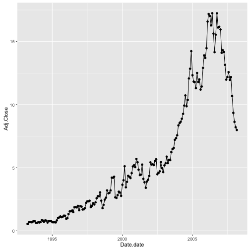
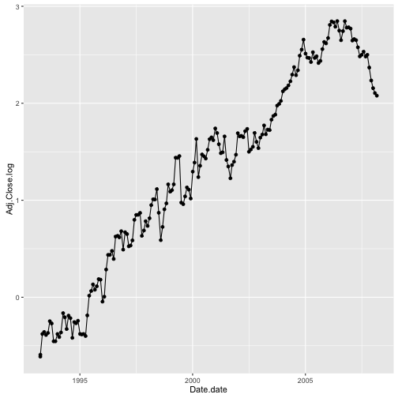
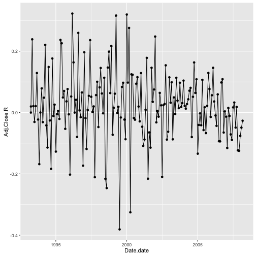
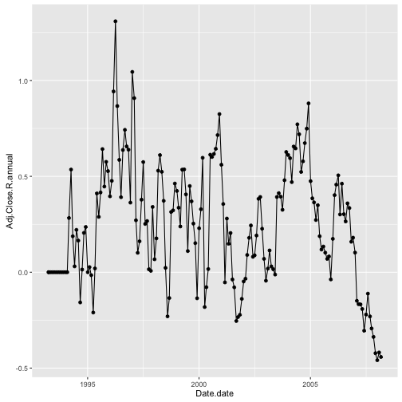
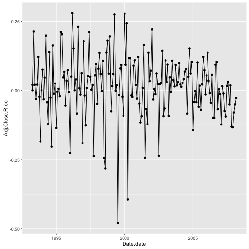
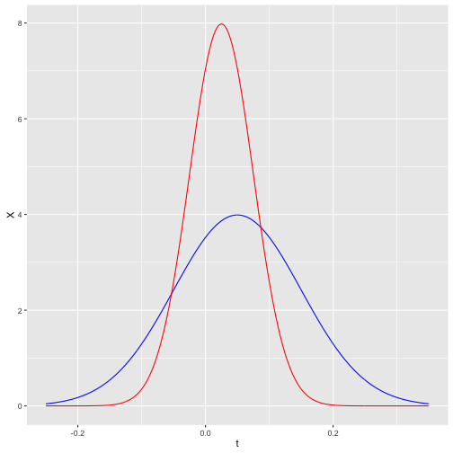

# Coursera: Intro to Computational Finance: Assignment 1b: Computing Asset Retrns with R


Go to [http://finance.yahoo.com](http://finance.yahoo.com) and download monthly data on Starbucks (ticker
symbol sbux) over the 15 year period March 31, 1993 to March 31, 2008. Read the
data into Excel and make sure to re-order the data so that time runs forward.
Do your analysis on the monthly closing price data (which should be adjusted
for dividends and stock splits). Name the spreadsheet tab with the data “data”.


    curl 'http://real-chart.finance.yahoo.com/table.csv?s=SBUX&a=2&b=31&c=1993&d=2&e=31&f=2008&g=m&ignore=.csv' \
         -o sbux.monthly.csv


1\. Make a time plot (line plot in Excel) of the monthly price data over the
period (end of) March 1993 through (end of) March 2008.


```r
    df = read.csv("sbux.monthly.csv")

    # Convert to date format.
    # Otherwise Date will be interpreted as a factor variable.
    # This matters when using Date on the x-axis in plots.
    # Apparently ggplot2 won't (easily) render line plots when
    # plotting a number var against a factor var.
    df$Date.date = as.Date(df$Date, "%Y-%m-%d") 

    df = df[order(df$Date.date),] 

    library(ggplot2)
    qplot(Date.date, Adj.Close, data=df, geom=c("point", "line"))
```




2\. If you invested $1,000 at the end of March 1993, approximately (round to
the nearest thousand) what would your investment be worth at the end of March 2008?


```r
    # simple return = delta-P / P0
    pt0 = df[1,]$Adj.Close
    pt1 = df[nrow(df),]$Adj.Close
    R = (pt1 - pt0) / pt0 
    PV = 1000
    FV = PV * (1 + R)
    FV
```

```
## [1] 14736.84
```
    
Answer: `FV = 14736.84`


3\. What is the approximate annual rate of return over this period assuming
annual compounding? (Hint: what is the effective annual rate for the 15 year
investment?)


```r
    # convert simple return to annually compounding annual rate
    # (1 + R_a)^15 = (1 + R)
    R_a = (1 + R)^(1/15) - 1
    R_a
```

```
## [1] 0.1964475
```

Answer: `R_a = 0.1964475`


4\. Make a time plot of the natural logarithm of monthly price data over the
period March 1993 to March 2008 


```r
    df$Adj.Close.log = log(df$Adj.Close)    
    qplot(Date.date, Adj.Close.log, data=df, geom=c("point", "line"))
```




5\. Using the monthly price data over the period March 1993 to March 2008 in
the “data” tab, compute simple monthly returns (Starbucks does not pay a
dividend). When computing returns, use the convention that Pt is the
end of month closing price. Make a time plot of the monthly returns. 
Keep in mind that the returns are percent per month.


```r
    R_m = numeric(nrow(df))

    for (i in 2:nrow(df)) {
        pt0 = df[i-1,]$Adj.Close
        pt1 = df[i,]$Adj.Close
        R_m[i] = (pt1 - pt0) / pt0
    }

    df$Adj.Close.R = R_m

    qplot(Date.date, Adj.Close.R, data=df, geom=c("point", "line"))
```




6\. Compute simple annual returns for the years 1993 through 2008 (note: there
are easy and hard ways to do this). Make a time plot of the annual returns. 

Note: You may compute annual returns using overlapping data or non-overlapping data. 
With overlapping data you get a series of annual returns for every month. That
is, the first month annual return is from the end of March, 1993 to the end of
March, 1994. The second month annual return is from the end of April, 1993 to
the end of April, 1994 etc. With non-overlapping data you get a series of 15
annual returns for the 15 year period 1993:March - 2008:March. That is, the
annual return for 1993:March - 1994:March is computed from the end of March
1993 through the end of March 1994. The second annual return is computed from
the end of March 1994 through the end of March 1995 etc.


```r
    R_a = numeric(nrow(df))

    for (i in 13:nrow(df)) {
        pt0 = df[i-12,]$Adj.Close
        pt1 = df[i,]$Adj.Close
        R_a[i] = (pt1 - pt0) / pt0
    }

    df$Adj.Close.R.annual = R_a

    qplot(Date.date, Adj.Close.R.annual, data=df, geom=c("point", "line"))
```




7\. Using the monthly price/return data over the period March 1993 to March
2008, compute continuously compounded (cc) monthly returns. Make a time plot 
of the monthly cc returns.


```r
    # Three ways to compute cc returns:
    # R_cc = log(1 + R)
    # R_cc = log( pt1 / pt0 )
    # R_cc = log(pt1) - log(pt0)

    R_cc1 = numeric(nrow(df))
    R_cc2 = numeric(nrow(df))
    R_cc3 = numeric(nrow(df))

    for (i in 2:nrow(df)) {

        R_cc1[i] = log(1 + df[i,]$Adj.Close.R)

        pt0 = df[i-1,]$Adj.Close
        pt1 = df[i,]$Adj.Close
        R_cc2[i] = log( pt1 / pt0 )

        pt0.log = df[i-1,]$Adj.Close.log
        pt1.log = df[i,]$Adj.Close.log
        R_cc3[i] = pt1.log - pt0.log
    }

    df$Adj.Close.R.cc = R_cc1

    qplot(Date.date, Adj.Close.R.cc, data=df, geom=c("point", "line"))
```




8\. Compute continuously compounded annual returns for the years 1993 through
2008 (Again, there are easy and hard ways to do this). Make a time plot of the
annual returns.


```r
    # Three ways to compute cc returns:
    # R_cc = log(1 + R)
    # R_cc = log( pt1 / pt0 )
    # R_cc = log(pt1) - log(pt0)

    R_cca = numeric(nrow(df))

    for (i in 13:nrow(df)) {
        R_cca[i] = log(1 + df[i,]$Adj.Close.R.annual)
    }

    df$Adj.Close.R.cc.annual = R_cca

    qplot(Date.date, Adj.Close.R.cc.annual, data=df, geom=c("point", "line"))
```



