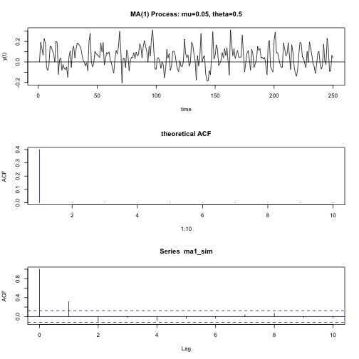

# Coursera: Intro to Computational Finance: Assignment 4-R: Time Series Simulations


1\. Consider the MA(1) model:

    Yt = 0.05 + e_t + theta * e_t-1

    e_t ~ iid N(0,0.1^2)

Simulate 250 observations from this model:


```r
    set.seed(123);
    # Simulate 250 observations from the described MA(1) model
    ma1_sim <- 0.05 + arima.sim( model=list(ma=0.5), n=250, mean=0, sd=0.1)
```

2\. Make a line plot of the observations in ma1_sim with the title "MA(1)
Process: mu=0.05, theta=0.5". Label the x-axis with "time" and the y-axis with
"y(t)". A line plot can be specified by setting type="l" of the plot()
function.  Add a horizontal line at zero.


```r
    plot(y=ma1_sim, 
         x=seq_along(ma1_sim), 
         main="MA(1) Process: mu=0.05, theta=0.5",
         xlab="time",
         ylab="y(t)",
         type="l")
    abline( h=0 )
```


3\.Use the ARMAacf function to calculate the theoretical autocorrelations up to
lag 10. Assign the result to acf\_ma1\_model.

Construct the plot of the sample autocorrelations up to lag 10 by using the
acf() function. Set the title of the plot to "Sample ACF". 


```r
    # Generate the theoretical ACF with upto lag 10
    acf_ma1_model <- ARMAacf(ma=c(0.5), lag.max=10)
    
    # Split plotting window in three rows
    par(mfrow=c(3,1))
    
    # First plot: The simulated observations
    plot(ma1_sim, type="l",main="MA(1) Process: mu=0.05, theta=0.5",xlab="time",ylab="y(t)")
    abline(h=0)
    
    # Second plot: Theoretical ACF
    plot(1:10, acf_ma1_model[2:11], type="h", col="blue",  ylab="ACF", main="theoretical ACF")
    
    # Third plot: Sample ACF
    # Assign to tmp the Sample ACF
    tmp <- acf(x=ma1_sim, lag.max=10, type=c("correlation") )
```



```r
    # Reset graphical window to only one graph
    par(mfrow=c(1,1))
```


4\. Now consider the AR(1) model

    Yt - 0.05 = phi * (Yt-1 - 0.05)

    e_t ~ iid N(0,0.1^2)

    phi = 0.5

Build the same three plots as for the MA model.


```r
    set.seed(123);
    # Simulate 250 observations from the described AR(1) model
    ar1_sim <- 0.05 + arima.sim( model=list(ar=0.5), n=250, mean=0, sd=0.1)
    # Generate the theoretical ACF with ten lags
    acf_ar1_model <- ARMAacf(ar=c(0.5), lag.max=10)
    
    # Split plotting window in three rows
    par(mfrow=c(3,1))
    
    # Generate the same three graphs as in the previous exercise 
    par(mfrow=c(3,1))
    
    # First plot: The simulated observations
    plot(ar1_sim, type="l", main="AR(1) Process: mu=0.05, phi=0.5",xlab="time",ylab="y(t)")
    abline(h=0)
    
    # Second plot: Theoretical AFC
    plot(1:10, acf_ar1_model[2:11], type="h", col="blue", main="theoretical ACF")
    
    # Third plot: Sample AFC
    tmp <- acf(x=ar1_sim, lag.max=10, type=c("correlation") )
```


```r
    # Reset plotting window to default
    par(mfrow=c(1,1));
```
