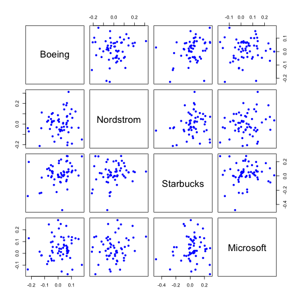

# Coursera: Intro to Computational Finance: Assignment 9-R: Portfolio Analysis

## Load Data

[http://s3.amazonaws.com/assets.datacamp.com/course/compfin/lab9.RData](http://s3.amazonaws.com/assets.datacamp.com/course/compfin/lab9.RData)

Copied locally (binary file): [../lab9.RData](lab9.RData)


```r
    library("zoo")

    # defines returns_df in the workspace
    load("lab9.RData")
```

```
## Warning: namespace 'slidify' is not available and has been replaced
## by .GlobalEnv when processing object '.SLIDIFY_ENV'
```

```r
    str(returns_df)
```

```
## 'zoo' series from Mar 1995 to Jan 2000
##   Data: num [1:59, 1:4] 0.153 0.023 0.0681 0.0617 0.0675 ...
##  - attr(*, "dimnames")=List of 2
##   ..$ : NULL
##   ..$ : chr [1:4] "Boeing" "Nordstrom" "Starbucks" "Microsoft"
##   Index: Class 'yearmon'  num [1:59] 1995 1995 1995 1995 1996 ...
```

```r
    rbind(head(returns_df),
          tail(returns_df))
```

```
##                Boeing    Nordstrom    Starbucks    Microsoft
## Mar 1995  0.152986072 -0.036153005  0.005213567  0.121301354
## Apr 1995  0.022992859 -0.056796794 -0.021053409  0.139234622
## May 1995  0.068082155  0.078207541  0.212444821  0.035293766
## Jun 1995  0.061746977 -0.003016273  0.203596782  0.065005425
## Jul 1995  0.067527004 -0.027569065  0.047965358  0.001379957
## Aug 1995 -0.045808827  0.027675498  0.067872071  0.021858794
## Aug 1999  0.001665287 -0.102166161 -0.016260521  0.075719408
## Sep 1999 -0.061141114 -0.047466906  0.080040690 -0.021843872
## Oct 1999  0.077557988 -0.079464255  0.092672008  0.021843872
## Nov 1999 -0.122442331  0.112173182 -0.023256862 -0.016509334
## Dec 1999  0.019801998 -0.055441448 -0.091083829  0.248660138
## Jan 2000  0.071301969 -0.179001658  0.277319285 -0.176343742
```

```r
    mu.vec <- apply(returns_df, 2, mean)
    sigma.vec <- apply(returns_df, 2, sd)
    Sigma.mat <- cov(returns_df)
    Rho.mat <- cor(returns_df)

    returns_df.mat <- coredata(returns_df)

    pairs(returns_df.mat,
          col="blue",
          pch=16)
```



```r
    rbind(mu.vec, sigma.vec)
```

```
##               Boeing   Nordstrom  Starbucks  Microsoft
## mu.vec    0.01130042 0.001545065 0.02846085 0.04271183
## sigma.vec 0.08047303 0.105456033 0.14216964 0.10060920
```

```r
    rbind(Sigma.mat,Rho.mat)
```

```
##                 Boeing    Nordstrom   Starbucks    Microsoft
## Boeing    0.0064759087 0.0008699794 0.003473484 0.0006925628
## Nordstrom 0.0008699794 0.0111209750 0.002636127 0.0018502818
## Starbucks 0.0034734841 0.0026361272 0.020212207 0.0011305061
## Microsoft 0.0006925628 0.0018502818 0.001130506 0.0101222108
## Boeing    1.0000000000 0.1025149457 0.303604422 0.0855403685
## Nordstrom 0.1025149457 1.0000000000 0.175828008 0.1743928820
## Starbucks 0.3036044218 0.1758280081 1.000000000 0.0790366166
## Microsoft 0.0855403685 0.1743928820 0.079036617 1.0000000000
```


### Question 1  Which two assets have the highest correlation?


```r
    Rho.mat
```

```
##               Boeing Nordstrom  Starbucks  Microsoft
## Boeing    1.00000000 0.1025149 0.30360442 0.08554037
## Nordstrom 0.10251495 1.0000000 0.17582801 0.17439288
## Starbucks 0.30360442 0.1758280 1.00000000 0.07903662
## Microsoft 0.08554037 0.1743929 0.07903662 1.00000000
```


### Question 2  What is the weight of Microsoft in the global minimum variance portfolio?


```r
    source("../my.portfolio.r")
    
    gmv.portfolio.weights = gmvPortfolio(mu.vec, Sigma.mat)
    gmv.portfolio.weights
```

```
##     Boeing  Nordstrom  Starbucks  Microsoft 
## 0.45620455 0.22325180 0.05122725 0.26931639
```

### Question 3  What is the standard deviation of the global minimum variance portfolio?


```r
    gmv.portfolio.mu = t(gmv.portfolio.weights) %*% mu.vec
    gmv.portfolio.sigma =  sqrt( t(gmv.portfolio.weights) %*% Sigma.mat %*% gmv.portfolio.weights )

    c("mu"=gmv.portfolio.mu, "sigma"=gmv.portfolio.sigma)
```

```
##         mu      sigma 
## 0.01846121 0.05927073
```

### Question 4  What is the expected return of the global minimum variance portfolio?


```r
    c("mu"=gmv.portfolio.mu, "sigma"=gmv.portfolio.sigma)
```

```
##         mu      sigma 
## 0.01846121 0.05927073
```

### Question 5  What happens to the global minimum variance portfolio if short sales are restricted?


```r
    gmv.ns.portfolio.weights <- gmvPortfolio.noShort(mu.vec, Sigma.mat)

    rbind( gmv.portfolio.weights, gmv.ns.portfolio.weights)
```

```
##                             Boeing Nordstrom  Starbucks Microsoft
## gmv.portfolio.weights    0.4562046 0.2232518 0.05122725 0.2693164
## gmv.ns.portfolio.weights 0.4562046 0.2232518 0.05122725 0.2693164
```

### Question 6  Compute Efficient Portfolio with Target Return Equal to the MAX Individual Asset Return:

Of the four stocks, determine the stock with the largest estimated expected return. 
Use this maximum average return as the target return for the computation of an
efficient portfolio allowing for short-sales. 

What is the weight of Microsoft in this portfolio?


```r
    eff.portfolio.weights <- effPortfolio(mu.vec, Sigma.mat, max(mu.vec))
    eff.portfolio.weights 
```

```
##     Boeing  Nordstrom  Starbucks  Microsoft 
##  0.1403515 -0.1852294  0.2257148  0.8191631
```

### Question 7  Compute Efficient Portfolio - NO SHORTING - with Target Return Equal to the MAX Individual Asset Return:


Of the four stocks, determine the stock with the largest estimated expected return. 
Use this maximum average return as the target return for the computation of an
efficient portfolio not allowing for short-sales. What is the weight of
Microsoft in this portfolio?


```r
    eff.ns.portfolio.weights <- effPortfolio.noShort(mu.vec, Sigma.mat, max(mu.vec))
    eff.ns.portfolio.weights 
```

```
##       Boeing    Nordstrom    Starbucks    Microsoft 
## 1.387779e-17 0.000000e+00 5.273559e-16 1.000000e+00
```


### Question 8 Convex combinations of efficient portfolios:

Using the fact that all efficient portfolios can be written as a convex
combination of two efficient portfolios, compute efficient portfolios as convex
combinations of the global minimum variance portfolio and the efficient
portfolio that was computed in question six. 

What is the expected return of the portfolio when α=.5?


```r
    alpha.vec=seq(0,1,by=0.1)
    eff.frontier.weights <- effFrontier(mu.vec, 
                                        Sigma.mat,
                                        alpha.vec=alpha.vec,
                                        gmv.portfolio.weights=gmv.portfolio.weights,
                                        eff.portfolio.weights=eff.portfolio.weights)
    cbind(alpha.vec, eff.frontier.weights)
```

```
##       alpha.vec    Boeing   Nordstrom  Starbucks Microsoft
##  [1,]       0.0 0.1403515 -0.18522939 0.22571477 0.8191631
##  [2,]       0.1 0.1719368 -0.14438127 0.20826602 0.7641785
##  [3,]       0.2 0.2035221 -0.10353315 0.19081727 0.7091938
##  [4,]       0.3 0.2351074 -0.06268503 0.17336852 0.6542091
##  [5,]       0.4 0.2666927 -0.02183691 0.15591977 0.5992244
##  [6,]       0.5 0.2982780  0.01901121 0.13847101 0.5442398
##  [7,]       0.6 0.3298633  0.05985933 0.12102226 0.4892551
##  [8,]       0.7 0.3614486  0.10070745 0.10357351 0.4342704
##  [9,]       0.8 0.3930339  0.14155557 0.08612476 0.3792857
## [10,]       0.9 0.4246192  0.18240368 0.06867600 0.3243011
## [11,]       1.0 0.4562046  0.22325180 0.05122725 0.2693164
```

```r
    eff.frontier.5.weights <- eff.frontier.weights[6,]
    eff.frontier.5.mu <- eff.frontier.5.weights %*% mu.vec
    eff.frontier.5.mu
```

```
##            [,1]
## [1,] 0.03058652
```

### Question 9  What is the weight of Microsoft in the tangency portfolio with short sales allowed?


```r
    rf <- 0.005
    tan.portfolio.weights <- tanPortfolio(mu.vec, Sigma.mat, rf)
    tan.portfolio.weights
```

```
##      Boeing   Nordstrom   Starbucks   Microsoft 
##  0.03874278 -0.31663617  0.28184672  0.99604668
```

### Question 10  What is the weight of Microsoft in the tangency portfolio with short sales not allowed?


```r
    tan.ns.portfolio.weights <- tanPortfolio.noShort(mu.vec, Sigma.mat, rf)
    tan.ns.portfolio.weights
```

```
##     Boeing  Nordstrom  Starbucks  Microsoft 
## 0.01714195 0.00000000 0.20367899 0.77917906
```
